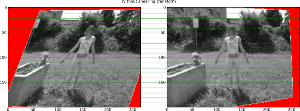
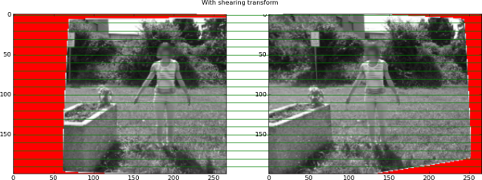

Python rectification demo
=========================
This is a Python implementation of the stereo rectification algorithm 11.12.3
of [HZ2], based on OpenCV's stereoRectifyUncalibrated code.

Additionaly, a function that compute Loop & Zhang ([LooZhang]) shearing
transform is included. This transform attempts to preserve perpendicularity
and aspect ratio on the images.

This was inspired by this post_.

Example
-------
Example images and correspondance are given in data/human. Simply run the
`rectification_demo.py` script. This script also works with VGG's dinosaur_
dataset : download the data and put it in data/dino.

Without Loop & Zhang shearing transform applied, this gives the following
result. The left image is quite distorted.

After applying the shearing transform, the left image looks better and
the epipolar lines are still correct. Note that the left image area should
be increased so the whole image is visible.

.. [HZ2] Multiple View Geometry in Computer Vision,
         Hartley, R.~I. and Zisserman, A.,
         Cambridge University Press, 2004

.. [LooZhang] Computing rectifying homographies for stereo vision,
              Loop, C. and Zhengyou Zhang,
              1999

.. _dinosaur: http://www.robots.ox.ac.uk/~vgg/data/data-mview.html

.. _post: http://scicomp.stackexchange.com/questions/2844/shearing-and-hartleys-rectification
